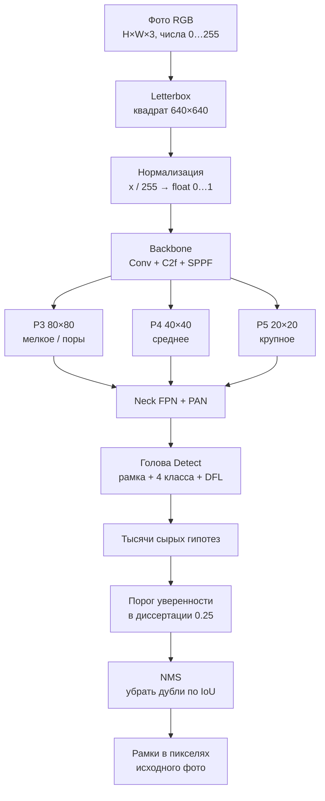
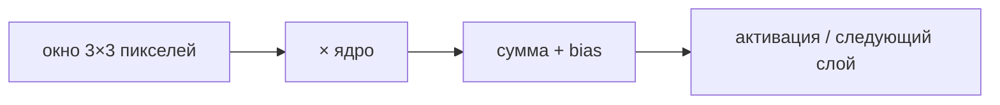
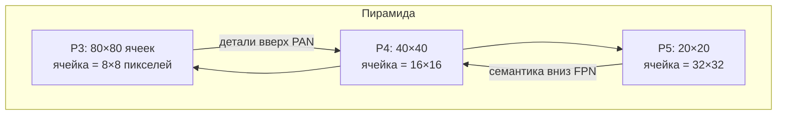
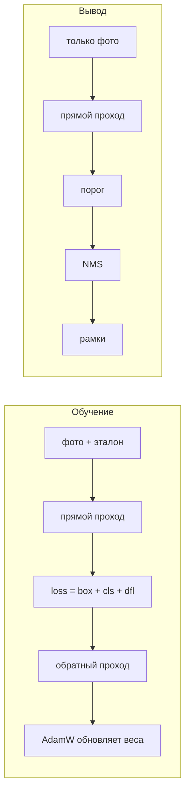

# Как устроена нейронная сеть WeldVision

Этот файл — теория. Картинки каждого шага на **вашем** кадре строит команда:

```bash
cd ml
python -m weldvision.cli explain-network --output outputs/network_tour
```

Откройте `outputs/network_tour/index.html` в браузере. Без весов будут синтетический шов,
числа пикселей, свёртка, архитектура, пирамида масштабов и NMS. С весами YOLOv8s
добавляются живые карты признаков:

```bash
python -m weldvision.cli explain-network \
  --output outputs/network_tour \
  --checkpoint /content/drive/MyDrive/SvarshikProAI/lohi_yolo_s/student_best.pt \
  --image /content/drive/MyDrive/SvarshikProAI/demo_weld.jpg \
  --device 0
```

Код генератора: `src/weldvision/network_tour.py`.

## Что сеть делает — и чего не делает

Рабочая модель диссертации — **YOLOv8s**. Это **детектор**: для каждого найденного
объекта она выдаёт прямоугольник (рамку), имя класса и число уверенности.

Классы LoHi-WELD, которые сеть умеет называть:

| id | имя              | смысл на шве                          |
|----|------------------|---------------------------------------|
| 0  | `pore`           | пора (мелкое тёмное пятно)            |
| 1  | `deposit`        | наплыв / брызги металла               |
| 2  | `discontinuity`  | несплошность, разрыв валика           |
| 3  | `stain`          | пятно, загрязнение поверхности        |

Это **не** классификатор всего кадра («дефект / норма»). На одном фото может быть
ноль, одна или несколько рамок разных классов.

Сеть **не** видит внутренний непровар, шлак в корне и пористость внутри металла:
камера даёт только поверхность. Поэтому детектор не заменяет ВИК / УЗК / РК.

Лицензия Ultralytics YOLOv8 — AGPL-3.0: веса можно использовать в диссертации,
но **нельзя** класть в приложение Google Play. Для магазина остаётся SSDLite /
Faster R-CNN.

## Прямой проход одним взглядом



Обучение этой стрелки не запускает: веса уже подобраны. HTML-тур показывает
именно **вывод** (inference).

## Шаг за шагом

### 1. Изображение как тензор

Человек видит валик. Сеть видит массив `высота × ширина × 3`. Красный, зелёный,
синий — три независимых числа. На промышленных кадрах LoHi они почти совпадают
(grayscale, повторённый в RGB). На смартфоне каналы разъедутся: баланс белого,
ржавчина, дуга, блик. Поэтому «просто прогнать YOLO, обученный на LoHi, по
телефону» — это уже другой домен, а не мелочь.

### 2. Letterbox, не растяжение

YOLOv8s ждёт квадрат **640×640**. Картинку масштабируют с сохранением пропорций
и дополняют серым (значение 114). Если вместо этого **растянуть** узкий кроп шва
до квадрата, геометрия пор ломается.

В этой работе letterbox на SSDLite B0 **ухудшил** AP50 с 0.28 до 0.12
(однофакторный опыт A1). Для YOLO поля допустимы: шея FPN/PAN лучше переносит
пустые полосы. Вывод для смартфона: сначала вырезать ROI шва, потом кормить
детектор плотным кропом, а не весь кадр с огромными полями.

Обратный ход после детекции:

```text
x_orig = (x_640 - pad_x) / scale
y_orig = (y_640 - pad_y) / scale
```

### 3. Нормализация

`x' = x / 255`. Веса сети живут в диапазоне, рассчитанном на числа 0…1.
Батч одной картинки: тензор `1 × 3 × 640 × 640`, тип float32.

### 4. Свёртка — атом сети

Фильтр 3×3 — таблица из девяти весов. Он скользит по карте. В каждой позиции:

```text
out = w11·x11 + w12·x12 + … + w33·x33 + bias
```

Положительный отклик значит «шаблон фильтра совпал с куском изображения».
Ранние фильтры находят края чешуи и тёмные точки пор. Поздние — комбинации
«это похоже на разрыв валика». Веса **не** рисует человек: их подбирает
обучение (миллионы таких чисел).

В HTML-туре шаг «одна свёртка» показан ядром Собеля по оси X: вертикальные
перепады яркости вспыхивают на карте отклика. В YOLO ядер тысячи, и они другие;
Собель нужен только чтобы увидеть операцию.



### 5. Backbone: C2f и SPPF

**C2f** — блок YOLOv8. Часть каналов идёт напрямую (skip), часть через мелкие
свёртки, затем всё склеивается. Skip не даёт градиенту затухнуть в глубокой сети
и сохраняет ранние края.

**SPPF** (Spatial Pyramid Pooling Fast): одна карта несколько раз прогоняется
через max-pooling 5×5 и склеивается. Крупный наплыв и мелкая пора попадают в
общий контекст без тяжёлой пирамиды.

Дальше картинка сжата по пространству, но «толще» по каналам: вместо 3 цветов —
десятки и сотни карт признаков.

### 6. Neck: зачем три масштаба



Пора занимает мало пикселей — её ищут на **P3**. Длинная несплошность и крупный
наплыв виднее на **P4/P5**. FPN несёт «смысл» с грубых карт на мелкие, PAN
возвращает детали обратно. SSDLite B0 слабее именно здесь: мелкие поры почти
не детектировались (recall ≈ 0.06). YOLOv8s на том же split дал pore recall 0.49.

### 7. Голова Detect

Для каждой ячейки каждой сетки сеть выдаёт:

- смещение центра рамки относительно ячейки;
- распределение расстояний до сторон рамки (**DFL**, Distribution Focal Loss) —
  не одно число ширины, а мягкое распределение, из которого берут ожидание;
- 4 логита классов `pore / deposit / discontinuity / stain`.

Отдельного класса «фон» нет. Пустая ячейка = низкая уверенность у всех четырёх.

Число ячеек на кадре 640: \(80^2 + 40^2 + 20^2 = 8400\). С несколькими
предсказаниями на ячейку это десятки тысяч сырых гипотез.

### 8. Порог уверенности

Рабочая точка диссертации: **score ≥ 0.25**. Ниже — больше найденных дефектов
и больше ложных рамок. Кривую AP считают с пола **0.001**, чтобы слабые, но
верные гипотезы не выкидывались из интеграла. Путать эти два порога нельзя:
иначе «AP ≈ 50% у случайного детектора» и другие артефакты.

### 9. NMS

**IoU** двух рамок — площадь пересечения, делённая на площадь объединения.
Если IoU высокий и класс один, слабая рамка удаляется (**Non-Maximum Suppression**).
Порог IoU в Ultralytics по умолчанию 0.5.

```text
IoU = area(A ∩ B) / area(A ∪ B)
```

Без NMS один разрыв валика превращается в веер почти одинаковых прямоугольников.

### 10. Обучение vs вывод



Пока веса подбираются, сеть «ошибается намеренно»: сравнивает себя с разметкой.
В HTML-туре и в приложении веса заморожены.

Метрики на test (macro AP50, recall по классам) считаются **после** порога и NMS,
тем же evaluator, что у SSDLite B0. Это позволяет честно сравнить архитектуры
на одном sequence-safe split.

## Две сети в одном проекте

| | SSDLite-MobileNetV3 B0 | YOLOv8s |
|---|---|---|
| Роль | замороженный слабый контроль | рабочий source-детектор диссертации |
| AP50 на sequence-safe test | 0.279 | 0.571 |
| recall `pore` | 0.056 | 0.493 |
| Letterbox | вреден (A1) | штатный вход |
| Лицензия | BSD (можно в Play после валидации) | AGPL (только исследование) |

Новизна диссертации — **не** «мы придумали YOLO», а адаптация уже сильного
детектора с промышленного grayscale к RGB смартфона.

## Что смотреть в HTML

1. Вход и RGB-каналы — что является данными.
2. Патч 8×8 с числами 0…255 — сырой ввод свёртки.
3. Letterbox 640×640 — геометрия входа YOLO.
4. Одна свёртка Собеля — операция слоя.
5. Схема backbone / neck / head.
6. Пирамида P3/P4/P5 — почему пора и наплыв живут на разных сетках.
7. Сетка Detect и учебный NMS.
8. Обучение vs вывод.
9. Если передан checkpoint: тепловые карты слоёв 0, 2, 4, 6, 9, 15, 18, 21
   и рамки до/после рабочего порога.

Рядом лежит `stages.json` — те же шаги машиночитаемо (для вставки в текст главы).
